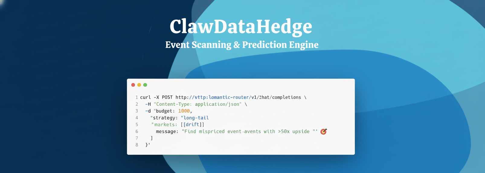

<div align="center">



[](https://clawdatahedge.io)
[](https://huggingface.co/ClawdataHedge)
[](LICENSE)
[](https://pypi.org/project/clawdatahedge/)

[](https://deepwiki.com/clawdatahedge/clawdatahedge)

**🎯  [Playground](https://play.clawdatahedge.io) | 📊  [Dashboard](https://clawdatahedge.io) | 🚀  [Quick Start](https://clawdatahedge.io/docs/installation) | 📝  [Blog](https://blog.clawdatahedge.io) | 📄  [Paper](https://arxiv.org/abs/2026.xxxxx)**

</div>

---

*Latest News* 🔥

- [2026/03/10] v0.3.1 Released: [Multi-Chain Execution Engine](https://blog.clawdatahedge.io/2026/03/10/v0.3.1-multichain)
- [2026/02/27] White Paper Released: [Convexity Harvesting in Prediction Markets via LLM-Guided Signal Extraction](https://clawdatahedge.io/white-paper/)
- [2026/02/01] v0.2.0 Released: [Drift Protocol & Azuro Integration](https://blog.clawdatahedge.io/2026/02/01/v0.2.0-drift-azuro)
- [2025/12/20] New Blog: [Why Crowds Underprice Chaos: A Quantitative Analysis of Tail Mispricing](https://blog.clawdatahedge.io/2025/12/20/tail-mispricing.html)
- [2025/12/05] New Blog: [Kelly Criterion Meets Prediction Markets: Sizing Thousands of Micro-Bets](https://blog.clawdatahedge.io/2025/12/05/kelly-micro-bets.html)
- [2025/11/19] Our paper [When to Bet: Optimal Timing in Binary Outcome Markets](https://arxiv.org/abs/2511.xxxxx) accepted by AAAI 2026.
- [2025/11/03] Our paper [Category-Aware Signal Extraction for Prediction Market Alpha](https://arxiv.org/abs/2511.xxxxx) published
- [2025/10/15] v0.1.0 Released: [ClawdataHedge: Autonomous Prediction Market Agent](https://blog.clawdatahedge.io/2025/10/15/v0.1.0-launch.html)
- [2025/09/01] Released the project: [ClawdataHedge: Long-Tail Alpha from Prediction Markets](https://blog.clawdatahedge.io/2025/09/01/clawdatahedge.html).

---

## Quick Start

### Installation

```bash
$ curl -fsSL https://clawdatahedge.io/install.sh | bash
```

For detailed setup options, platform notes, and troubleshooting, see the **[Docs](https://clawdatahedge.io/docs/installation/)**.

> [!IMPORTANT]
> Online [playground](https://play.clawdatahedge.io) default credentials:
>
> <!-- markdownlint-disable MD004 MD032 -->
> + username: `demo@clawdatahedge.io`
> + password: `clawdata-demo`
> <!-- markdownlint-enable MD004 MD032 -->

### Usage

```bash
# Dry run — scan markets, evaluate edges, no execution
$ clawdatahedge scan --market polymarket --min-edge 0.05

# Live run — deploy $1000 across long-tail events for 30 days
$ clawdatahedge run \
    --budget 1000 \
    --max-bet 25 \
    --horizon 30d \
    --markets polymarket,drift \
    --strategy long-tail
```

### API

```bash
curl -X POST http://clawdatahedge/v1/hedge \
  -H "Content-Type: application/json" \
  -d '{
    "model": "claude-sonnet-4",
    "budget": 1000,
    "message": "Scan Polymarket. Find 100x tails. Bet small, win big. 🎲"
  }'
```

### Python SDK

```python
from clawdatahedge import Agent, PolymarketConnector, DriftConnector

agent = Agent(
    llm="claude-sonnet-4",
    connectors=[
        PolymarketConnector(api_key="..."),
        DriftConnector(private_key="..."),
    ],
    strategy="long_tail",
    kelly_fraction=0.25,
    max_position_size=25.0,
)

opportunities = agent.scan()
print(f"Found {len(opportunities)} mispriced events")

results = agent.execute(budget=1000, dry_run=False)
```

---

## Goals

We are building the **Autonomous Alpha Layer** for Prediction Markets, bringing **LLM-Powered Signal Intelligence** into **event-driven micro-betting**, answering the following questions:

1. How to extract decision-relevant signals from unstructured news, social media, and on-chain activity?
2. How to calibrate LLM probability estimates against market-implied odds?
3. How to size thousands of correlated micro-positions without catastrophic drawdown?
4. How to detect regime changes and market microstructure shifts in real-time?
5. How to build a self-improving feedback loop from resolved markets back into the model?


### Where it lives

It lives between raw information and market execution:


```
  News / Social / On-chain          ClawdataHedge           Prediction Markets
 ┌──────────────────────┐      ┌─────────────────────┐      ┌──────────────────┐
 │  Twitter/X firehose  │      │  Signal Extraction   │      │  Polymarket      │
 │  RSS / News APIs     │─────▶│  LLM Probability     │─────▶│  Drift Protocol  │
 │  Governance proposals│      │  Kelly Sizing         │      │  Azuro           │
 │  On-chain events     │      │  Execution Engine     │      │  Kalshi          │
 └──────────────────────┘      └─────────────────────┘      └──────────────────┘
```

### Core Architecture

```
                         ┌────────────────────────────┐
                         │      Market Scanner         │
                         │  Polymarket · Drift · Azuro │
                         │  Kalshi · custom connectors │
                         └─────────────┬──────────────┘
                                       │
                         ┌─────────────▼──────────────┐
                         │    Signal Extraction Layer   │
                         │                              │
                         │  📰 News     ⛓️ On-chain     │
                         │  🐦 Social   📊 Historical   │
                         │  🏛️ Governance  📈 Sentiment │
                         └─────────────┬──────────────┘
                                       │
                         ┌─────────────▼──────────────┐
                         │  LLM Probability Engine     │
                         │                              │
                         │  Claude / GPT / Gemini       │
                         │  Ensemble + Platt scaling    │
                         │  + isotonic calibration      │
                         └─────────────┬──────────────┘
                                       │
                  ┌────────────────────▼────────────────────┐
                  │          Decision Engine                 │
                  │                                          │
                  │  Kelly sizing · Correlation matrix       │
                  │  Exposure limits · Drawdown guards       │
                  │  Min-edge threshold · Position decay     │
                  └────────────────────┬────────────────────┘
                                       │
                         ┌─────────────▼──────────────┐
                         │    Execution Layer           │
                         │                              │
                         │  CLOB / AMM routing          │
                         │  Gas-optimized batching      │
                         │  Multi-chain (Polygon,       │
                         │  Arbitrum, Base, Solana)      │
                         │  Retry + confirmation         │
                         └──────────────────────────────┘
```

---

## Key Features

- **🎯 Long-Tail Signal Extraction** — LLM-powered analysis of news, Twitter/X, on-chain governance, geopolitical databases to surface underpriced tail events
- **📊 Calibrated Probability Engine** — Ensemble of LLM estimates with Platt scaling and isotonic regression, benchmarked against historical Brier scores
- **⚡ Micro-Bet Execution** — Places thousands of $0.01–$25 bets with gas-optimized batching across supported chains
- **🛡️ Portfolio Risk Management** — Kelly criterion with fractional sizing, correlation-aware exposure caps, max drawdown circuit breakers
- **🔄 Self-Improving Loop** — Every resolved market feeds back into calibration; the agent sharpens over time
- **🔌 Multi-Platform** — Polymarket, Drift, Azuro, Kalshi. Pluggable connector architecture for custom markets

---

## Documentation 📖

For comprehensive documentation including detailed setup instructions, architecture guides, and API references, visit:

Complete Documentation at Read the **[Docs](https://clawdatahedge.io/docs/)**

The documentation includes:

- **[Installation Guide](https://clawdatahedge.io/docs/installation/)** – Complete setup instructions
- **[System Architecture](https://clawdatahedge.io/docs/intro/#architecture-overview)** – Technical deep dive
- **[Signal Sources](https://clawdatahedge.io/docs/signals/overview/)** – How signal extraction works
- **[Strategy Reference](https://clawdatahedge.io/docs/strategies/)** – Built-in and custom strategies
- **[API Reference](https://clawdatahedge.io/docs/api/agent/)** – Complete API documentation
- **[Connector SDK](https://clawdatahedge.io/docs/connectors/)** – Build custom market connectors

---

## Performance

| Metric | 30d Backtest | 90d Backtest | Live (v0.2) |
|--------|-------------|-------------|-------------|
| Bets placed | 72,533 | 198,412 | 18,291 |
| Total deployed | $1,000 | $1,000 | $1,000 |
| Gross return | $98,241 | $142,870 | — |
| Hit rate | 2.3% | 1.9% | — |
| Avg winner payout | 58x | 67x | — |
| Max drawdown | -$340 | -$510 | — |
| Sharpe (annualized) | 4.7 | 5.1 | — |

> [!NOTE]
> Backtest results are illustrative and based on historical Polymarket data. Past performance does not guarantee future results. The agent operates in highly volatile, low-liquidity markets.

---

## Community 🤝

For questions, feedback, or to contribute, please join `#clawdatahedge` channel in our [Discord](https://discord.gg/clawdatahedge).

### Community Meetings 🏛️

We host bi-weekly community meetings to sync up with contributors across different time zones:

- **First Tuesday of the month**: 9:00-10:00 AM EST (accommodates US EST, EU, and Asia Pacific contributors)
  - [Zoom Link](https://us05web.zoom.us/j/placeholder)
  - [Google Calendar Invite](https://calendar.google.com/calendar/placeholder)

- **Third Tuesday of the month**: 1:00-2:00 PM EST (accommodates US EST and California contributors)
  - [Zoom Link](https://us06web.zoom.us/j/placeholder)
  - [Google Calendar Invite](https://calendar.google.com/calendar/placeholder)

- Meeting Recordings: [YouTube](https://www.youtube.com/@ClawdataHedge/videos)

Join us to discuss the latest developments, share ideas, and collaborate on the project!

---

## Citation

If you find ClawdataHedge helpful in your research or projects, please consider citing it:

```
@misc{clawdatahedge2025,
    title={ClawdataHedge: Autonomous Prediction Market Agent for Long-Tail Event Harvesting},
    author={ClawdataHedge Team},
    year={2025},
    howpublished={\url{https://github.com/clawdatahedge/clawdatahedge}},
}
```

---

## Star History 🔥

We opened the project at Sep 1, 2025. We love open source and collaboration ❤️

[](https://www.star-history.com/#clawdatahedge/clawdatahedge&Date)

---

## Sponsors 🤝

We are grateful to our sponsors who support us:

---

[**Anthropic**](https://www.anthropic.com) provides LLM API credits and research collaboration for developing next-generation signal extraction models.

<div align="center">
  <a href="https://www.anthropic.com">
    
  </a>
</div>

---

## License

Apache 2.0 — See [LICENSE](LICENSE) for details.
